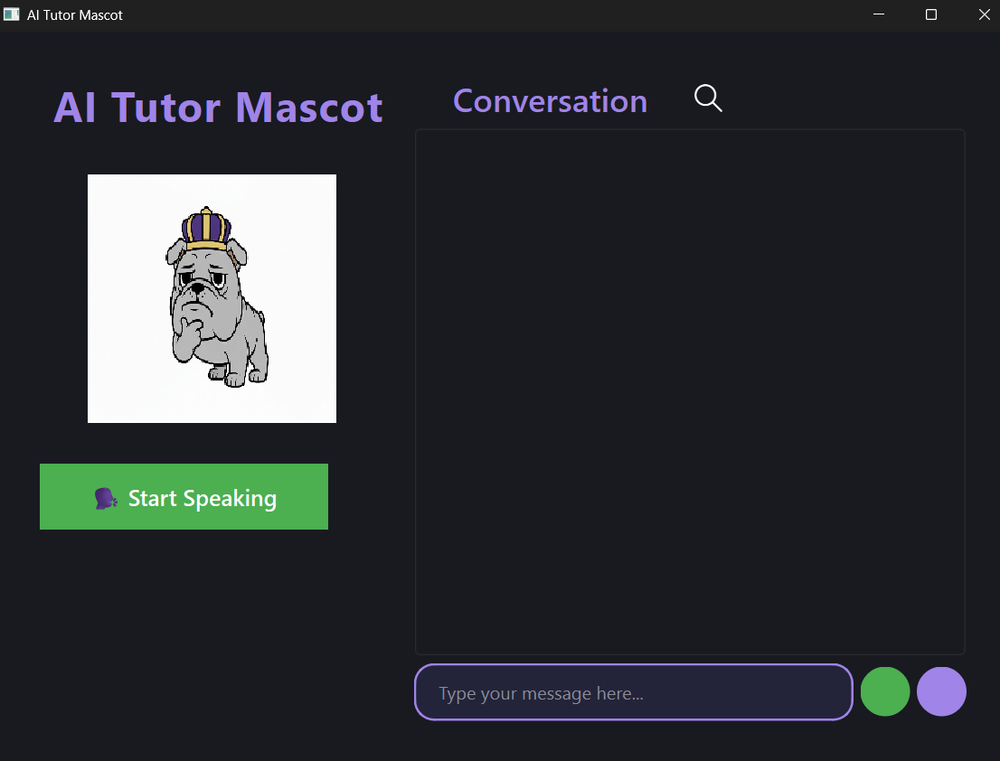

# AI Tutor Mascot – Submission Materials

---

## 1. System Architecture / Flow Diagram

**Description:**
- The user interacts with the PyQt6 frontend (AI Tutor Mascot app).
- The frontend communicates with the FastAPI backend for chat responses.
- The backend uses a RAG (Retrieval-Augmented Generation) pipeline to generate answers.
- Speech-to-text (STT) and text-to-speech (TTS) modules are integrated with the frontend.

**Diagram:**

```
+---------+         +----------------+         +-------------------+
|  User   | <---->  | PyQt6 Frontend | <---->  | FastAPI Backend   |
+---------+         +----------------+         +-------------------+
                        ^   |                        |
                        |   v                        v
                 +-------------+              +-------------------+
                 |   STT/TTS   |              |   RAG Pipeline    |
                 +-------------+              +-------------------+
```

---

## 2. Code Snippets or GitHub Link

**GitHub Repository:**
[https://github.com/Sidsidhuz/AiTutorMascot](https://github.com/Sidsidhuz/AiTutorMascot)

**Key Code Snippet (API Call):**
```python
def make_api_call(user_question, chat_history):
    payload = {
        "question": user_question,
        "history": [
            {"question": msg["text"], "answer": msg["text"]}
            for msg in chat_history if "text" in msg and ("role" in msg and (msg["role"] == "user" or msg["role"] == "ai"))
        ]
    }
    response = requests.post(
        f"{BACKEND_URL}/chat",
        json=payload,
        headers={"Content-Type": "application/json"}
    )
    return response.json()
```

---

## 3. API Documentation (Basic Endpoints)

### POST `/chat`
- **Description:** Get an AI response to a user question with chat history.
- **Request Body:**
```json
{
  "question": "string",
  "history": [
    { "question": "string", "answer": "string" }
  ]
}
```
- **Response:**
```json
{
  "text": "string",      // AI's answer
  "emotion": "string"    // e.g., happy, sad, neutral
}
```

---

## 4. Screenshots of Working System

**Main UI:**


*The screenshot above shows the main application window with mascot, chat area, and controls.*

---

*End of Required Materials*
