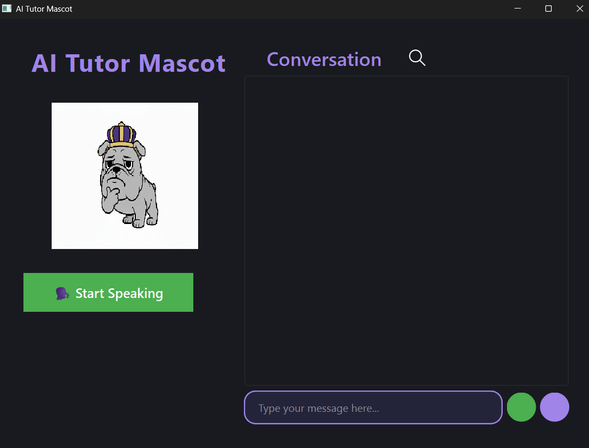

# AI Tutor Mascot Project Documentation

## Overview
The AI Tutor Mascot is an interactive desktop application designed to provide a modern, engaging chat interface for educational purposes. It features an animated mascot, emotion-based responses, and a chat UI with speech-to-text (STT) and text-to-speech (TTS) capabilities. The project is built with a PyQt6 frontend and a FastAPI backend, and uses a Retrieval-Augmented Generation (RAG) pipeline for intelligent responses.

---

## Project Structure

```
ai_tutor_mascot/
├── backend/
│   ├── main.py           # FastAPI backend server
│   └── rag_pipeline.py   # RAG logic for answer generation
├── frontend/
│   └── mascot.py         # PyQt6 frontend application
├── stt_tts/
│   ├── stt.py            # Speech-to-text logic
│   └── tts.py            # Text-to-speech logic
```

---

## Components

### 1. Frontend (`frontend/mascot.py`)
- **Purpose:** Implements the main UI and user interaction logic using PyQt6.
- **Key Features:**
  - Animated mascot (GIFs) with emotion states (happy, sad, thinking, etc.)
  - Modern chat UI with chat bubbles, scrollable area (scroll bar hidden)
  - Speech-to-text input and text-to-speech output
  - Temporary chat bubbles for "Listening..." and "Thinking..." states
  - Error handling and status indication

#### Main Classes:
- `MascotUI`: Main window, manages layout, chat, mascot state, and user input.
- `WorkerThread`: Handles backend API and TTS calls in a separate thread.
- `MascotGlowFrame`: Displays the mascot GIF (no glow or border).
- `ChatBubbleArea`: Manages chat bubbles and temporary status bubbles.
- `ChatBubble`: Custom QLabel for chat messages (user/mascot, status-aware).
- `ThinkingIndicator`: Animated label for "Mascot is thinking..." status.

#### UI/UX Details:
- Left panel: Mascot, app title, and controls
- Right panel: Conversation header, chat area, input field, and send/mic buttons
- Chat area: Scrollable, but scroll bar is hidden for a clean look
- Mascot GIF changes based on emotion/state

### 2. Backend (`backend/main.py`, `backend/rag_pipeline.py`)
- **Purpose:** Provides a FastAPI server for handling chat requests and generating responses using a RAG pipeline.
- **Endpoints:**
  - `/chat`: Accepts user questions and chat history, returns AI response and emotion
- **RAG Pipeline:**
  - Retrieves relevant context and generates answers for user queries

### 3. Speech Modules (`stt_tts/stt.py`, `stt_tts/tts.py`)
- **Purpose:**
  - `stt.py`: Handles speech recognition (microphone input to text)
  - `tts.py`: Handles text-to-speech (AI response to audio output)

---

## How It Works
1. **User Input:**
   - User can type a message or use the microphone to speak.
   - Speech is transcribed to text using `listen_and_transcribe()` from `stt.py`.
2. **Chat Handling:**
   - User message is displayed as a chat bubble.
   - Temporary "Listening..." or "Thinking..." bubbles are shown as needed.
3. **Backend Communication:**
   - The frontend sends the user question and chat history to the FastAPI backend (`/chat` endpoint).
   - The backend uses the RAG pipeline to generate a response and emotion label.
4. **AI Response:**
   - The AI's response is displayed as a chat bubble.
   - The mascot GIF updates to reflect the emotion.
   - The response is spoken aloud using `speak()` from `tts.py`.
5. **UI Feedback:**
   - Status indicators and error messages are shown as needed.
   - The chat area auto-scrolls to the latest message.

---

## Key Design Decisions
- **Modern UI:** Uses PyQt6 for a clean, modern look with custom styling.
- **Animated Mascot:** Emotion-based GIFs for engaging feedback.
- **Threading:** Worker thread prevents UI freezing during API/TTS calls.
- **Temporary Bubbles:** "Listening..." and "Thinking..." bubbles are automatically removed after use.
- **Scroll Bar Hidden:** Chat area is scrollable, but the scroll bar is hidden for aesthetics.
- **Error Handling:** Robust error messages and status updates for user clarity.

---

## Setup & Usage
1. **Install Dependencies:**
   - Python 3.11+
   - PyQt6, requests, FastAPI, and other required packages
2. **Run Backend:**
   - Navigate to `backend/` and start the FastAPI server (e.g., `uvicorn main:app --reload`)
3. **Run Frontend:**
   - Navigate to `frontend/` and run `mascot.py` (e.g., `python mascot.py`)
4. **Assets:**
   - Place mascot GIFs in `assets/mascot/` as referenced in the code

---

## Customization
- **Mascot GIFs:** Add or replace GIFs in `assets/mascot/` for different emotions.
- **Styling:** Adjust colors, fonts, and layout in `mascot.py` for a different look.
- **Backend Logic:** Modify `rag_pipeline.py` for improved answer generation.
- **Speech Modules:** Swap out `stt.py`/`tts.py` for different STT/TTS providers.

---

## Troubleshooting
- **UI Errors:** Ensure PyQt6 is installed and compatible with your Python version.
- **Backend Not Responding:** Check that the FastAPI server is running and accessible at the configured URL.
- **Speech Issues:** Verify microphone permissions and TTS engine setup.
- **Missing Assets:** Ensure all referenced GIFs and icons are present in the correct directories.

---

## Screenshots

### Main Application UI


*The screenshot above shows the main application window with mascot, chat area, and controls.*

---

## Credits
- Developed by Sidsidhuz and contributors.
- Mascot GIFs and UI design inspired by modern chat applications.

---

## License
This project is licensed under the MIT License. See `LICENSE` for details.
